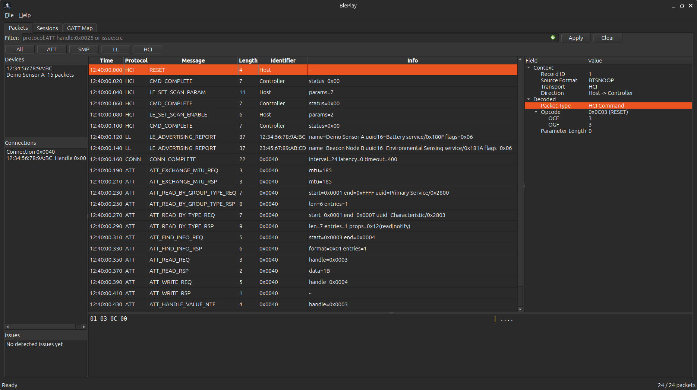
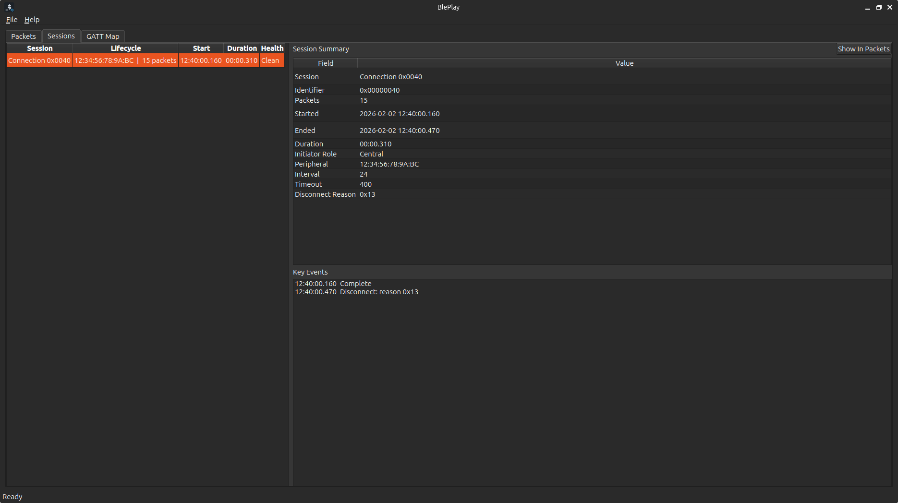
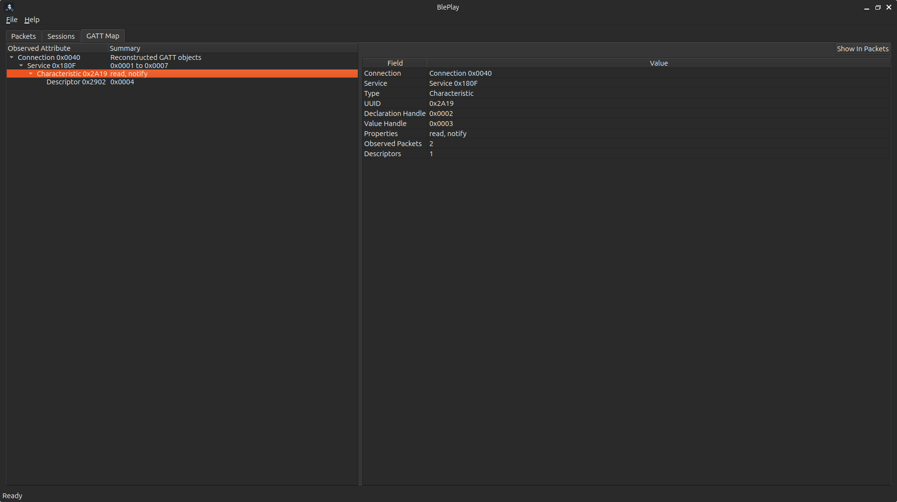

# BlePlay

中文 | [English](./README.en.md)

BlePlay 是一个基于 Qt6 Widgets 的桌面 BLE 抓包分析工具，用于离线查看和分析 `.btt`、`btsnoop`、`.pklg` 等日志。它面向蓝牙协议调试、连接过程排查和 GATT 行为观察场景，帮助用户从原始抓包快速定位到可读协议事件、会话上下文和属性结构。

## 功能特性

- 导入 `.btt`、`btsnoop`、`.pklg` 等 BLE/HCI 日志文件
- 提供 `Packets`、`Sessions`、`GATT Map` 三个核心工作视图
- 支持按协议、设备、连接、句柄、错误状态和文本内容进行筛选
- 支持逐包查看字段详情与十六进制原始数据
- 支持从会话视图或 GATT 视图反向跳转到相关数据包

## 使用场景

- 分析 Android、iOS 或 Ellisys 导出的 BLE/HCI 抓包日志
- 排查配对失败、连接异常、中断断开等问题
- 回溯 ATT、SMP、LL Control 等协议交互过程
- 观察服务、特征、描述符和 handle 的发现与访问行为

## 界面说明

BlePlay 当前提供三个核心工作视图：

- `Packets`：用于逐包浏览、过滤、详情树查看和 hex 数据检查
- `Sessions`：用于按连接或会话理解时序、角色和关键事件
- `GATT Map`：用于查看服务、特征、描述符及其关联数据包

主界面围绕一份共享分析文档工作，不同视图之间可联动跳转，适合在一次分析过程中从包级细节切换到连接上下文或 GATT 结构。

## 演示截图

按主界面、会话视图、GATT 视图的顺序展示如下：







## Ubuntu 桌面安装

Linux 发布包目录 `BlePlay-<version>-linux-x86_64/` 内提供了 `install.sh`，用于安装 BlePlay 可执行文件、桌面启动器和图标。实际执行时可直接使用通配路径匹配当前版本目录。

脚本支持以下能力：

- 默认执行用户级安装
- 安装应用文件、命令入口和 `.desktop` 启动项到用户目录

使用示例：

```bash
chmod +x ./BlePlay-*-linux-x86_64/install.sh
./BlePlay-*-linux-x86_64/install.sh
```

如需帮助，可直接执行脚本查看参数说明。

## 项目定位

BlePlay 专注于桌面端 BLE 抓包分析，强调以下几点：

- 基于 Qt 构建，便于在 Linux、Windows 等平台上保持一致体验
- 以协议分析工作台为定位，覆盖包级查看、会话理解和 GATT 结构观察
- 使用统一业务模型支撑多个视图，避免在不同界面重复扫描或聚合数据
